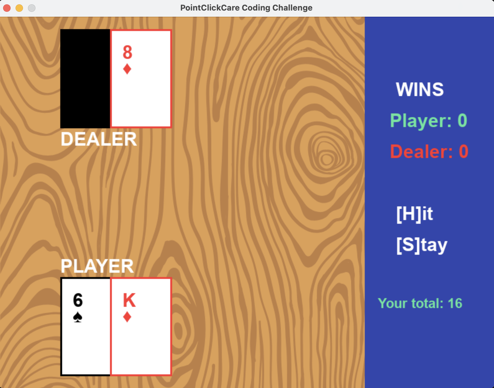
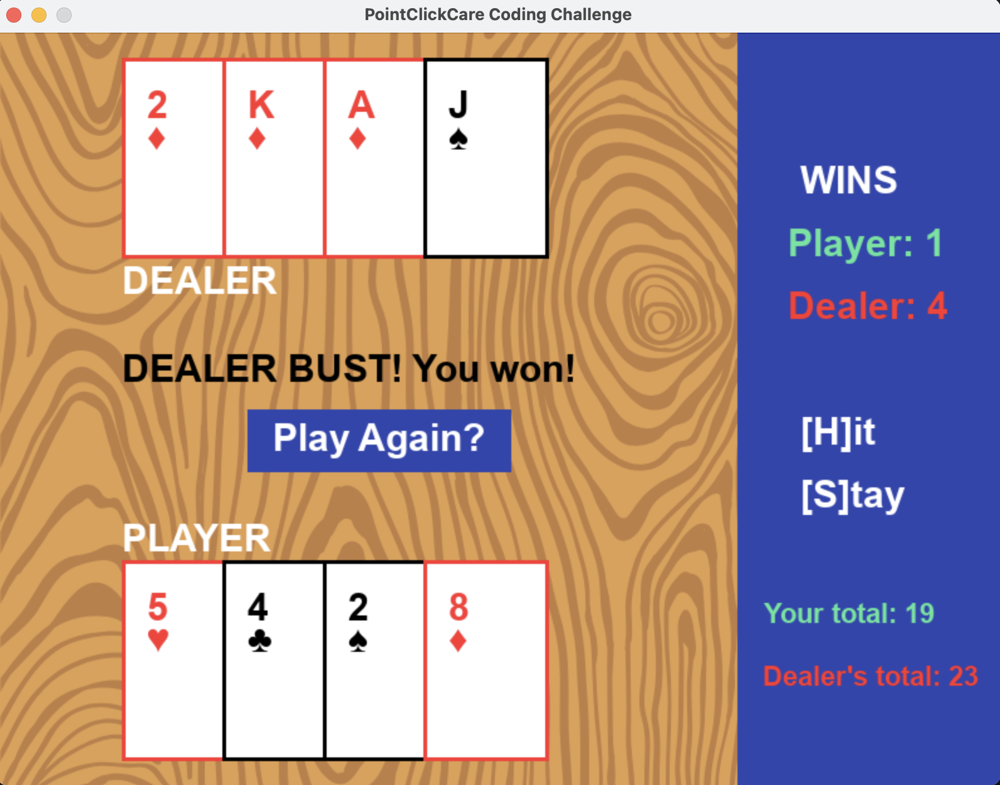

# 21_Game

This is my version of the 21 Card Game, built with visuals using Pygame!

## Controls
On your keyboard, press:  
H - Hit (to draw another card)  
S - Stay (to end your turn)  
Click the in-game "Play Again?" button to start another round   

## Set-up Instructions
- Clone the repository  
- Ensure Python 3.7 or higher is installed   
- Install pygame  
`pip install pygame`  
- Run main.py to start the game!  

## Game Demos
Here is a video demo: https://drive.google.com/file/d/1MujZpwOKljTsSxibNdYaIM3p8aOjj5P5/view?usp=sharing 

