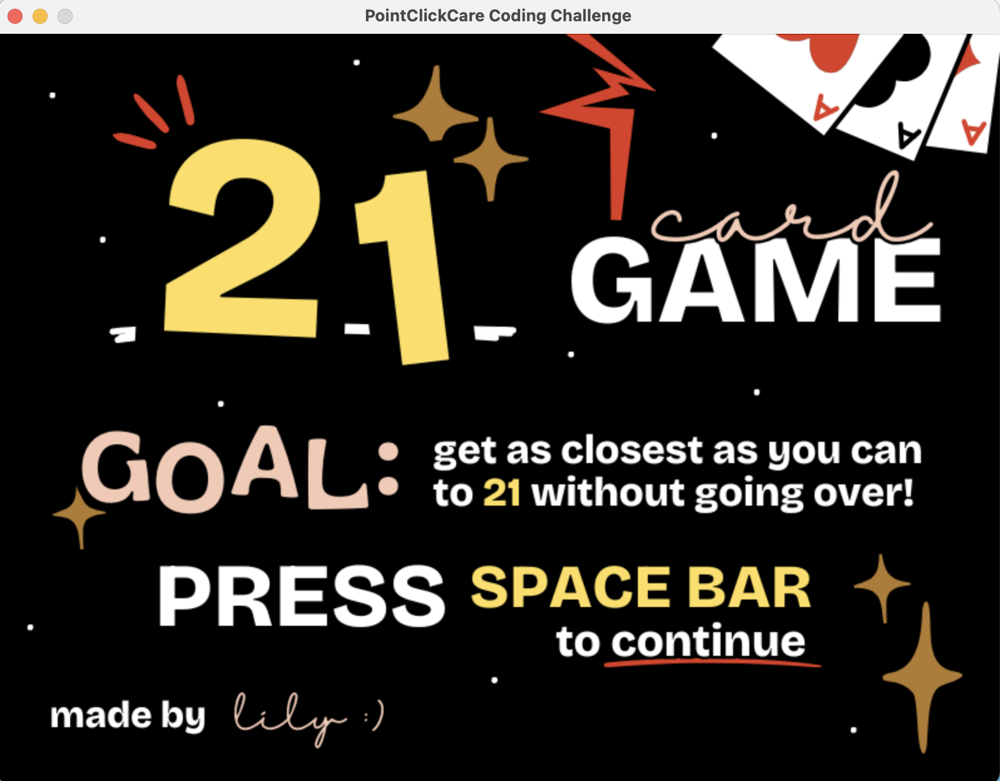
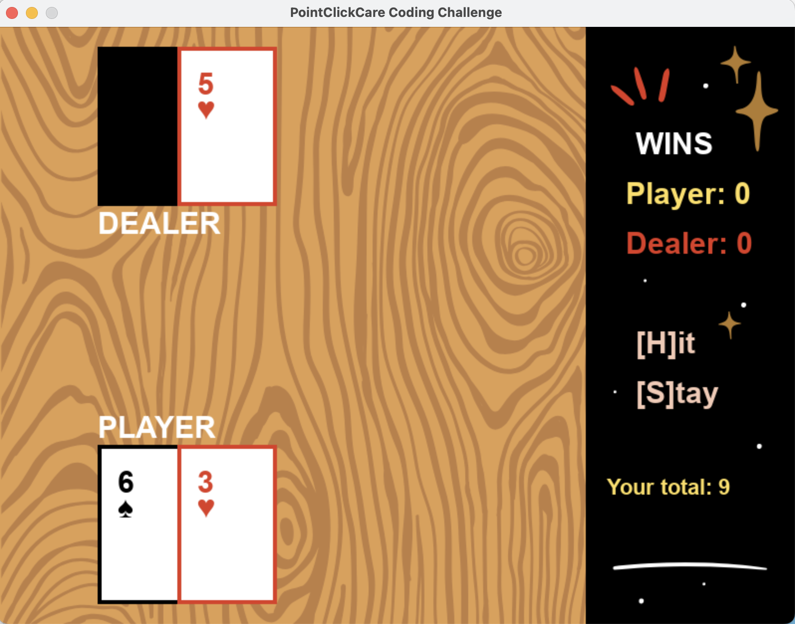

# 21 Card Game 🂮

**Welcome!**    
This my version of the 21 Card Game in Python, built with visuals using Pygame.
Try to beat the dealer without going over 21!

## Features 🎉
- Hand totals for player and dealer
- Win counter for player and dealer
- Sound effects for wins/losses

## Controls ⌨️
On your keyboard, press:  
**H** - Hit (to draw another card)  
**S** - Stay (to end your turn)  
Click the in-game "**Play Again?**" button to start another round   

## Set-up Instructions 💻
- Clone the repository  
- Ensure Python 3.7 or higher is installed   
- Install pygame  
`pip install pygame`  
- Run main.py to start the game!  

## Game Demos!! 
Here is a video demo: https://drive.google.com/file/d/1-c6dazDtZafIE2jkyH0kiHiIE5XuESr-/view?usp=sharing

This was my first time using GitHub for a project; thank you for checking it out!
If you run into any issues, feel free to reach out: L1397b@gmail.com
